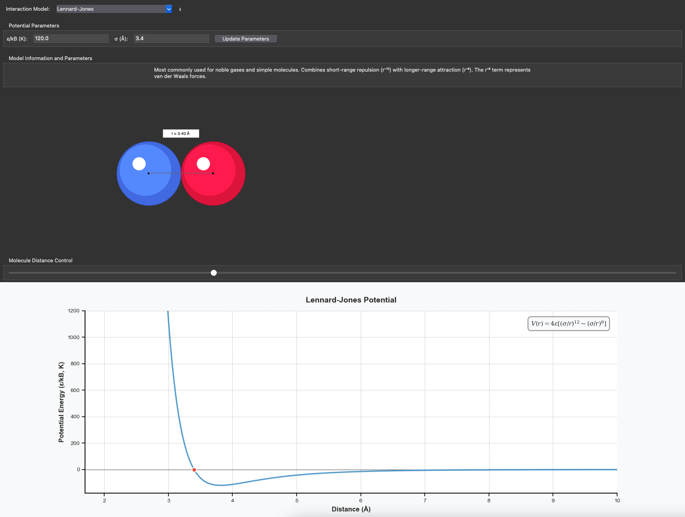

# pyPairViz

An interactive visualization tool for exploring molecular interaction potentials. This application provides a graphical interface to visualize and understand different molecular potential models commonly used in physics and chemistry.

A simplified web application can be found [here](https://pypairviz.streamlit.app/).



## Features

- Interactive visualization of various molecular potential models:
  - Lennard-Jones Potential
  - Hard Sphere Model
  - Square Well Potential 
  - Sutherland Potential
  - Morse Potential
  - Buckingham Potential
  - Yukawa Potential
  - Mie Potential

- Real-time visualization of:
  - Potential energy curves
  - Molecular distance relationships
  - 3D-style molecule representations

- Adjustable parameters for each potential model:
  - Energy parameter (ε/kB)
  - Distance parameter (σ)
  - Model-specific parameters (e.g., width parameter for Morse potential)

- Interactive features:
  - Distance slider with magnetic snap points
  - Dynamic parameter updates
  - Hover tooltips with model information
  - Real-time plot updates

## Installation
1. Clone this repository:
```bash
git clone https://github.com/njcorrente/molecular-viz
cd molecular-viz
```

2. Install requirements:
```bash
pip install -r requirements.txt
```

3. Run the application:
```bash
python pyPairViz/main.py
```
## Requirements

- Python 3.7+
- NumPy 
- Matplotlib
- Tkinter (usually comes with Python)

## Usage

1. Launch the application using the command above
2. Select a potential model from the dropdown menu
3. Adjust the parameters using the input fields
4. Use the slider to change the distance between molecules
5. Observe the potential energy curve and molecular visualization update in real-time

## Potential Models

The application includes several important molecular potential models:

- **Lennard-Jones**: Common for noble gases and simple molecules
- **Hard Sphere**: Simplest model for rigid sphere interactions 
- **Square Well**: Used for studying phase transitions
- **Sutherland**: Historical model with hard-core repulsion
- **Morse**: Suitable for diatomic molecules
- **Buckingham**: Alternative to Lennard-Jones with exponential repulsion
- **Yukawa**: Used in plasma physics and colloidal systems
- **Mie**: Generalized form of Lennard-Jones with adjustable exponents

## Contributing

Contributions are welcome! Please feel free to submit pull requests, create issues, or suggest new features.

## License

This project is licensed under the MIT License - see the LICENSE file for details.

## Authors

- Nick Corrente (@njcorrente)

# Citations

## Molecular Potential Models

### Lennard-Jones Potential
- J. E. Lennard-Jones, "On the Determination of Molecular Fields," Proc. R. Soc. Lond. A 106, 463-477 (1924)
- https://doi.org/10.1098/rspa.1924.0082

### Hard Sphere Potential  
- B. J. Alder and T. E. Wainwright, "Phase Transition for a Hard Sphere System," J. Chem. Phys. 27, 1208 (1957)
- https://doi.org/10.1063/1.1743957

### Square Well Potential
- K. R. Hall, "Another Hard-Sphere Equation of State," J. Chem. Phys. 57, 2252 (1972)
- https://doi.org/10.1063/1.1678576

### Sutherland Potential
- W. Sutherland, "The Viscosity of Gases and Molecular Force," Phil. Mag. Series 5, 36:223, 507-531 (1893)
- https://doi.org/10.1080/14786449308620508

### Morse Potential
- P. M. Morse, "Diatomic Molecules According to the Wave Mechanics. II. Vibrational Levels," Phys. Rev. 34, 57 (1929)
- https://doi.org/10.1103/PhysRev.34.57

### Buckingham Potential
- R. A. Buckingham, "The Classical Equation of State of Gaseous Helium, Neon and Argon," Proc. R. Soc. Lond. A 168, 264-283 (1938)
- https://doi.org/10.1098/rspa.1938.0173

### Yukawa Potential
- H. Yukawa, "On the Interaction of Elementary Particles," Proc. Phys. Math. Soc. Jpn. 17, 48-57 (1935)
- https://doi.org/10.11429/ppmsj1919.17.0_48

### Mie Potential
- G. Mie, "Zur kinetischen Theorie der einatomigen Körper," Ann. Phys. 316, 657-697 (1903)
- https://doi.org/10.1002/andp.19033160802

## Additional Key References

### Statistical Mechanics & Molecular Simulation
- M. P. Allen and D. J. Tildesley, "Computer Simulation of Liquids," Oxford University Press (1987)
- ISBN: 978-0198556459

### Hard Sphere Theory
- J. D. Weeks, D. Chandler, and H. C. Andersen, "Role of Repulsive Forces in Determining the Equilibrium Structure of Simple Liquids," J. Chem. Phys. 54, 5237 (1971)
- https://doi.org/10.1063/1.1674820

### Equation of State Development
- N. F. Carnahan and K. E. Starling, "Equation of State for Nonattracting Rigid Spheres," J. Chem. Phys. 51, 635 (1969)
- https://doi.org/10.1063/1.1672048
